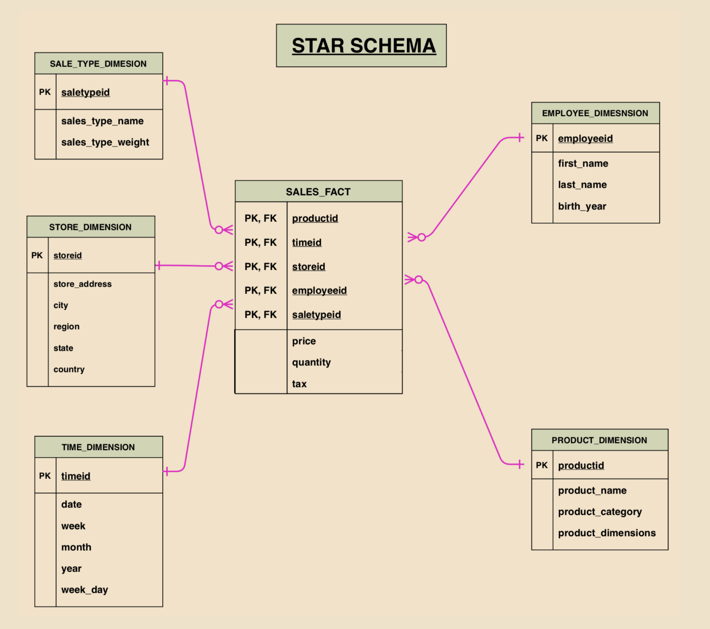

# Data Managment Architectures for Analytics
## Databases and Data Warehouses
- In the 1980s, the focus was on batch processing, where data would be processed in nightly runs on large mainframe computers.
- In the 1990s, the use of databases exploded, and organizations found themselves with tens, or even hundreds, of databases supporting different business processes.
- Generally, these databases were for transactional processing, and the ability to perform analytics across systems was very limited.
- As a result, in the 1990s, **data warehouses** become a popular tool where data could be ingested from multiple database systems into a central repository, and the data warehouse could focus on running analytic reports.
- The data warehouse was designed to store well-integrated, highly structured, highly curated, and highly trusted data. 
- Data would be ingested on a regular basis from other highly structured sources, but before entering the data warehouse, the data would go through a significant amount of preprocessing, validation, and transformations. 
- Any changes to the data warehouse schema, or the need to ingest new data sources, would require a significant effort to plan the schema and related processes.
- Early data warehouses were custom-built using common relational databases on powerful servers, but they required IT teams to manage host servers, storage, software, and integrations with data sources. 
- These were difficult to manage, and so in the mid-2000s, there was an emergence of purpose-built hardware appliances designed as modular data warehouse appliances, built for terabyte- and petabyte-scale big data processing.
- These appliances contained new hardware and software innovations and were delivered as easy to install and manage units from popular vendors such as **Oracle, Teradata, IBM Netezza, Pivotal Greenplum** and others.

## Dealing with big, unstructured data
- While data warehouses have steadily evolved over the last 25+ years to support increasing volumes of highly structured data, there has been exponential growth in semi-structured and unstructured data produced by modern digital platforms (such as mobile and web applications, sensors, IoT devices, social media, and audio and video media platforms). 
- These platforms produce data at a high velocity, and in much larger volumes than data produced by traditional structured sources.
- Traditional data warehouses are good at storing and managing flat, structured data from sources such as a set of tables, organized as a relational schema. 
- However, they are not well suited to handling the huge volumes of high velocity semi-structured and unstructured data, which are becoming increasingly popular.
- As a result, in the early 2010s, new technologies for big data processing became popular. 
- **Hadoop**, an open source framework for processing large datasets on clusters of computers, became the leading way to work with big data. 
- These clusters contained tens of hundreds of machines with attached disk volumes that could hold tens of thousands of terabytes of data managed under a single distributed filesystem known as the **Hadoop Distributed File System (HDFS).**
- Hadoop Providers: **Cloudera, Hortonworks, MapR, and IBM.**

## Cloud Based Solutions for Big Data Analytics
- Making use of cloud solutions for big data processing has a number of benefits, including:
    - On-demand capacity
    - Limitless and elastic scaling
    - Global footprint
    - Usage-based cost models
    - Freedom from managing hardware
- Cloud Solution Providers for ingesting, storing, and analyzing large data sets: **Google Compute Cloud (GCP), Microsoft Azure, Snowflake, and Databricks.**
- **AWS** launched **Amazon EMR in 2009 (a managed platform for running Hadoop frameworks), and Amazon Redshift in 2013 (a cloud native data warehouse)**
- **Cloud object stores**, such as **Amazon S3**, can store hundreds of petabytes of data at a fraction of the cost of on-prem storage, and support storing data regardless of its source, format or structure. 
- They also provide native integrations with hundreds of cloud native and third-party data processing and analytics tools. 
- These new cloud object stores have enabled organizations to build a new, more integrated analytics data management approach with decoupled compute and storage, called a **data lake architecture.** 
- A data lake architecture makes it possible to create a single source of truth by bringing together a variety of data of all sizes and types (structured, semi-structured, unstructured) in one place: a central, highly scalable repository built using inexpensive cloud storage.
- Instead of lifting and shifting existing data warehouses and Hadoop clusters to the cloud as-is, many organizations are instead refactoring their previously on-premise workloads to build an integrated cloud data lake. 
- In this approach, all data is first ingested, processed and stored in the data lake to build a single source of truth, and then a subset of the “hot” data is loaded into the dimensional schemas of a cloud data warehouse to support lower latency access.
- A variety of new technologies that enable integrating the best of data lakes and data warehousing capabilities, is called the **Data Lake House approach (or Lakehouse).**
- Its capabilities include:
    - Ability to quickly ingest any type of data
    - Storing and processing petabytes of unstructured, semi-structured, and structured data
    - Support for **ACID** transactions (the ability to concurrently read, insert, update, and delete records in a dataset managed by the data lakehouse)
    - Low latency data access
    - Ability to consume data with a variety of tools, including SQL, Spark, machine learning frameworks, and business intelligence tools

## A Deeper Dive into Data Warehouse Concepts and Architecture
- An **Enterprise Data Warehouse (EDW)** is the central data repository that contains structured, curated, consistent, and trusted data assets that are organized into a well-modeled schema. 
- The *data assets* in an EDW are made up of all the relevant information about key business domains and are built by integrating data sourced from the following places:
    - Run-the-business transactional applications (ERPs, CRMs, Line of Business applications) that support all the key business domains across the enterprise.
    - External data sources such as data from partners and third parties.
- An enterprise data warehouse provides business users and decision-makers with an easy-to-use, central platform that helps them find and analyze a well-modeled, well-integrated, single version of truth about various business subject areas such as customer, product, sales, marketing, supply chain, and more. 
- Business users analyze data in the warehouse to measure business performance, find current and historical business trends, find business opportunities, and understand customer behavior.
- A data warehouse-centric architecture includes the following:
    - Data sources from across the business that provide raw data to the data warehouse via ETL or ELT processes
    - One or more data warehouses (and optionally multiple subject focused data marts)
    - End user analytic tools for consuming data from the warehouse (such as SQL based analytic tools, and Business Intelligence visualization systems)

- **Data marts** contain a subset of the data from the warehouse, focused and optimized for queries on a specific business domain (sales, finance, product, etc).

## Dimensional Modelling in Data Warehouses
- Data assets in the warehouse are typically stored as relational tables that are organized into widely used dimensional models, such as a **Star schema or Snowflake schema.**
- Storing data in a warehouse using a dimensional model makes it easier to retrieve and filter relevant data, and it also makes analytic query processing flexible, simple and performant.

- In data warehouses, tables are generally separated into **fact tables and dimension tables.**
- A fact table stores granular numeric measurements/metrics for a specific domain (such as sales).
- SALES_FACT table stores facts about an individual sales transaction, such as the sales price and quantity sold. 
- The fact table also has a large number of foreign key columns that reference the primary keys of associated dimension tables. 
- The dimension tables store the context under which fact measurements were captured. 
- We have dimension tables with information on stores, products, and other dimensions related to each sale transaction. 
- Each individual dimension table essentially provides granular attributes related to one of the dimensions of the fact (such as the store where the sale took place).
- Dimensional attributes are key to finding and aggregating measurements stored in the fact tables in a data warehouse.
- In a Star schema, while data for a subject area is normalized by splitting measurements and context information into separate fact and dimension tables, individual dimension tables are typically kept denormalized so that all related attributes of a dimensional topic can be found in a single table. 
- This makes it easier to find all related attributes of a dimensional topic in a single table (fewer joins, and a simpler to understand model), but for larger dimension tables, a denormalized approach can lead to data duplication and inconsistencies within the dimension table. 
- Large denormalized dimension tables can also be slow to update.
- One approach to work around these issues is a slightly modified type of schema, the Snowflake schema.

- The challenges of inconsistencies and duplication in a Star schema can be addressed by snowflaking (basically normalizing) each dimension table into multiple related dimension tables (normalizing the original product dimension into product and product category dimensions, for example). 
- This normalizing of tables continues until each individual dimension table contains only attributes with direct correlation to the table’s primary key. 
- The highly normalized model resulting from this snowflaking is called a Snowflake schema.
- The Snowflake schema can be designed by extending the Star schema, or can be built from the ground up by ensuring that each dimension is highly normalized and connected to related dimension tables forming a hierarchy. 
- A Snowflake schema can reduce redundancy and minimize disk space, compared to a Star schema which often contains duplicate records. 
- However, on the other hand, the Snowflake schema may necessitate complex joins to answer business queries and may slow down query performance.

## Understanding the role of Data Marts
- Data warehouses contain data from all relevant business domains and have a comprehensive, yet complex schema. 
- Data warehouses are designed for the cross-domain analysis that’s required to inform strategic business decisions. 
- However, organizations often also have a narrower set of users who want to focus on a particular line of business, department, or business subject area. 
- These users prefer to work with a repository that has a simple-to-learn schema, and only the subset of data that focuses on the area they are interested in. 
- Organizations typically build data marts to serve these users.
- A data mart is focused on a single business subject repository (for example, marketing, sales or finance), and is typically created to serve a narrower group of business users, such as a single department. 
- A data mart often has a set of denormalized fact tables organized in a much simpler schema compared to that of an enterprise data warehouse. 
- Simpler schemas and a reduced amount of data volume make data marts faster to build, simpler to understand, and easier to use for end users. 
- A data mart can be created either as:
    - Top down. Data is taken from an existing data warehouse, focused on a slice of business subject data
    - Bottom up. Data is sourced directly from run-the-business applications related to a business domain of interest.

## Distributed Storage and Massively Parallel Processing

- An **Amazon Redshift cluster** contains a **leader node** and one or more **compute nodes.**
    - The leader node interfaces with client applications, receives and parses queries, and coordinates query execution on compute nodes.
    - Multiple compute nodes have high-performance storage to store a subset of the warehouse data and run query execution steps in parallel on the data that they store.
    - For RA3 node types, **Amazon S3 is used as Redshift Managed Storage (RMS) for warehouse data**, and the compute node high-performance local storage is used as a cache for hot data.

- Each compute node has its own independent processors, memory and high-performance storage volumes that are isolated from other compute nodes in the cluster (this is called a **shared-nothing architecture).** 
- Cloud data warehouses implement a distributed query processing architecture called **Massively Parallel Processing (MPP)** to accelerate queries on massive volumes of data. 
- In this approach, the cluster leader node first compiles the incoming client query into a distributed execution plan. 
- It then coordinates execution of segments of compiled query code on multiple compute nodes of the data warehouse cluster, in parallel. 
- Each compute node executes assigned query segments on a portion of the distributed dataset.

## Columnar Data Storage and Efficient Data Compression
- Modern data warehouses also boost query performance through **column-oriented storage and data compression.**
- OLTP applications typically work with entire rows that include all columns of the table (for example, read/write a sales record, or look up a catalog record). 
- To serve OLTP applications, backend databases need to efficiently read and write full rows to the disk. 
- To speed up full row lookups and updates, OLTP databases use a row-oriented layout to store table rows on the disk. 
- In a row-oriented physical data layout, all the column values of a given row are co-located.

- Most analytics queries that business users run against a data warehouse are written to answer a specific question and typically include grouping and aggregations (such as sum, average, mean) on a large number of rows, but of a narrow set of columns from fact and dimension tables.
- A row-oriented physical data layout forces analytics queries to scan a large number of full rows (all columns), even though they need only a subset of the columns from these rows. 
- Analytics queries on a row-oriented database can thus require a much higher number of disk I/O operations than necessary.
- Modern data warehouses store data on disks using a column-oriented physical layout.
- While storing a table's data in a column-oriented physical layout, a data warehouse breaks a table into groups of rows, called row chunks/groups. 
- It then takes a row chunk at a time and lays out data from that row chunk, one column at a time, so that all the values for a column (that is, for that row chunk) are physically co-located on the disk.

- Data warehouses also maintain in-memory maps of the locations of these chunks. 
- Modern data warehouses use these in-memory maps to pin-point column locations on the disk and read the physically co-located values of the column. 
- This enables the query engine to retrieve data for only the narrow set of columns needed for a given analytics query. 
- By doing this, disk I/O is significantly reduced compared to what would be required to run the same query on a row-oriented database.
- Modern data warehouses also employ multiple compression algorithms for a table. 
- The warehouse is able to match individual columns with the compression algorithm that is most optimal for the given column’s type and profile of its data content.
- In addition to saving storage space, compressed data requires much lower disk I/O to read and write data to the disk. 
- Compression algorithms provide much better compression ratios when all values being compressed have the same data type and have a larger percentage of duplicates. 
- Since column-oriented databases lay out values of the same column (hence the same data type, such as strings or integers) together, data warehouses achieve good compression ratios, resulting in faster read/writes, and smaller on-disk footprints.

## Feeding data into the warehouse – ETL and ELT pipelines

- To bring data into the warehouse (and optionally, data marts), organizations typically build data pipelines that do the following:
    - Extract data from source systems.
    - Transform source data by validating, cleaning, standardizing, and curating it.
    - Load the transformed source data into the enterprise data warehouse schema, and optionally a data mart as well.

- In these pipelines, the first step is to extract data from source systems, but the next two steps can either take on a Transform-Load or Load-Transform sequence (so either ETL, or ELT).
- The components that are used to implement the Extract step of both ETL and ELT pipelines typically need to connect to these sources and handle diverse data formats (including relational tables, flat files, and continuous streams of records).
- The decision as to whether to build an **Extract-Transform-Load (ETL) or Extract-Load-Transform (ELT)** data pipeline is based on the following:
    - The complexity of the required data transformations.
    - The skills and tools the organization has available to build data transformation steps
    - The speed at which source data needs to be made available for analysis in the data warehouse after it's produced in the source system.

- With an ETL pipeline, transformations are performed outside of the data warehouse using custom scripts, a cloud-native ETL service such as **AWS Glue, or a specialized ETL tool from a commercial vendor such as Informatica, Talend, DataStage, Microsoft, or Pentaho.**
- An ETL pipeline could consist of the following:
    - One or more systems that extract data from various sources (databases, SaaS solutions, file storage, etc) and write the data to a raw / staging storage area
    - One or more transformation jobs that read data from the raw / staging storage area, transforms the data, and then writes it to a transformed storage area
    - Another system that reads data from the transformed storage area, and loads the data into the Data Warehouse

- A transformation engine may run multiple transformation jobs to perform tasks such as validating data, cleaning data, and transforming data for the target data warehouse dimensional schema. 
- An ETL approach to building a data pipeline is typically used when the following are true:
    - Source database technologies and formats are different from those of the data warehouse
    - The engineering team wants to perform transformations using a programming language (such as PySpark) rather than pure SQL
    - Data transformations are complex and compute intensive

- An Extract-Load-Transform (ELT) pipeline extracts data (typically highly structured data) from various sources and loads it as-is into a staging area of the data warehouse. 
- The database engine powering the data warehouse is then used to perform transformation operations on the staged data and writes the transformed data to a production table (ready for consumption).

- The ELT approach allows for rapidly loading large amounts of source data into the warehouse. 
- Furthermore, the MPP architecture of modern data warehouses can significantly accelerate the transform steps in ELT pipelines. 
- The ELT approach is typically leveraged when the following are true:
    - Data sources and the warehouse have similar database technologies, making it easier to directly load source data into the staging tables in the warehouse.
    - A large volume of data needs to be quickly loaded into the warehouse.
    - All the required transformation steps can be executed using the native SQL capabilities of the warehouse's database engine.
- The primary difference between ETL and ELT is about where the data transformation takes place. 
- With ELT, the data is loaded directly into the data warehouse, and the data warehouse engine is used for the transformation (typically using SQL to create a new transformed version of the data). 
- With ETL, an engine outside of the data warehouse first transforms the data before writing it to the data warehouse.

## An overview of data lake architecture and concepts
- The lack of a well-defined tabular structure makes unstructured and semi-structured data less suitable for storing in typical data warehouses.
- Data warehouses are limited to processing data using only SQL, and SQL is not the right tool for all data processing requirements.
- A cloud data lake is a central, highly scalable repository in the cloud where an organization can manage exabytes of various types of data, including:
    - Structured data (row-column based tables)
    - Semi-structured data (such as JSON and XML files, log records, and sensor data streams)
    - Unstructured data (such as audio, video streams, Word/PDF documents and emails)
- Data from any of these sources can be quickly loaded into the data lake as-is (keeping the original source format and structure). 
- Unlike with data warehouses, data does not need to first be converted to a standard structure before it is consumed. 
- A cloud data lake also natively integrates with cloud analytic services that are decoupled from data lake storage, and enables diverse analytic tools, including SQL, code-based tools (such as Apache Spark), specialized machine learning tools, and Business Intelligence visualization tools.

## Data Lake Logical Architecture

- A data lake architecture contains a set of independent components organized into five logical layers. 
- A layered, component-oriented data lake architecture can evolve over time to incorporate new innovations in data management and analytics methods, as well as to make use of new tools. 
- This keeps the data lake responsive to new data sources and changing requirements.

### The Storage Layer and Storage Zones
- Provides virtually unlimited, low-cost storage that can store a variety of data, irrespective of the structure or format. 
- The storage layer is organized into different zones, with each zone having a specific purpose. 
- Data moves through the various zones of the data lake, with new, modified copies of the data in each zone as the data goes through various transformations.
- **Landing/Raw zone.** This is the zone where the ingestion layer writes data, as-is, from the source systems.
- **Clean/Transform zone.** The initial data processing of data in the landing/raw zone, such as validating, cleaning, and optimizing data sets, writes data into the clean/transform zone. 
- The data here is often stored in optimized formats such as Parquet, and is often partitioned to accelerate query execution and downstream processing.
- **Curated/Enriched zone.** The data in the clean/transformed zone may be further refined and enriched with business specific logic and transformations, and this data is written to the curated/enriched zone. 
- This data is in its most consumable state and meets all organizational standards (cleanliness, file formats, schema).

### Catalog and Search Layer
- A **technical catalog** is used to map the many files stored in the storage layer into a logical representation of databases and tables, with each table having columns of a specific data type (the table schema).
- A technical catalog, such as the **Amazon Glue data catalog**, stores the metadata that defines the relationship between physical files on storage and a table definition in the catalog. 
- Consumption tools (such as **Amazon Athena**) can use the technical catalog to understand which files to read from the storage layer when a user queries a specific database and table.
- A **business catalog** focuses on the metadata that is important to the business. 
- This may include attributes such as the data owner, date the dataset was last updated, a description of the table purpose, column definitions, and more. 
- The business catalog may also integrate with the technical catalog in order to provide information on table schema in the business catalog interface. 
- The business catalog should also support the ability to do advanced searches, enabling teams to find data that is relevant to their use cases.

### Ingestion Layer
- The ingestion layer is responsible for connecting to diverse types of data sources and bringing their data into the landing/raw zone of the storage layer. 
- This layer may contain a variety of independent tools, each purpose-built to connect to a data source with a distinct profile in terms of:
    - Data structure (structured, semi-structured, unstructured)
    - Data delivery type (table rows, data stream, data file)
    - Data production cadence (batch, streaming)
- This approach provides the flexibility to easily add in new tools to match a new data source’s distinct profile.
- **AWS DMS (Database Migration Service)** for ingesting from various databases, **Amazon Kinesis Firehose** to ingest streaming data, and **Amazon AppFlow** to ingest data from SaaS applications.

### Processing Layer
- The processing layer transforms the data in the lake through various stages of data cleanup, standardization, and enrichment. 
- Along the way, the processing layer stores transformed data in the different zones – writing it into the clean zone and then the curated zone, and then ensuring that the technical data catalog gets updated.
- Components in the ingestion and processing layers are used to create Extract-Load-Transform (ELT) pipelines. 
- In these pipelines, the ingestion layer components extract data from the source systems, and loads the data into the data lake, and then the processing layer components transform it to make it suitable for consumption by components in the consumption layer.

### Consumption Layer
- Once data is ingested and processed to make it consumption ready, it can be analyzed using several techniques, such as interactive query processing, business intelligence dashboarding, and machine learning. 
- To perform analytics on data in the lake, the consumption layer provides purpose-built tools that are able to access data from the storage layer, and the schema from the catalog layer (to apply schema-on-read to the lake hosted data).

## Bringing together the best of Data Warehouses and Data Lakes
- Traditional implementations of data lakes do not support the ACID properties common in most databases. 
- Also, due to the use of inexpensive object storage as the storage layer, query performance does not match what is possible with data warehouses that use high performance SSD based local storage.
- This is solved by loading a subset of the data from the data lake into a data warehouse, such as **Amazon Redshift or Snowflake**.
- However, data warehouse storage is expensive, and some use cases require joining data across a diverse set of data and it is not economical to load all this data into the data warehouse.
- To work around these challenges, new table formats have been created that simplify the process of updating data lake tables in a transactionally safe way, and new functionality is available to enable federated queries (joins of data across different storage engines), in an approach often referred to as a Data Lake House.

## The Data Lake House Approach
- This can be done in two ways: First, change the table format. 
- Intended to enable simplified and more consistent updates and reads of data lake data (especially when you have multiple teams working with the same dataset), as well as offering performance improvements, and the ability to query a table as it was at a point-in-time (often referred to as time travel).
- Second, functionality that enables queries across different database engines or storage platforms.
- Cloud data warehouses such as Amazon Redshift and Snowflake are able to query data loaded into the data warehouse, as well as data in an Amazon S3 based data lake.
- With this approach, the most recent 12 months of data could be loaded into the data warehouse, while the previous 4 years of data could be stored in the data lake. 
- Most queries would only be querying the most recent 12 months of data, and that would be stored within the highly-performant storage of the data warehouse. 
- However, for those queries that needed to access the historical information, the data warehouse could join tables in the S3 data lake with the recent data in the data warehouse. 
- This query federation can extend beyond just joining tables in the data warehouse and tables in the S3-based data lake, to querying data in other storage engines as well.
- With Amazon Redshift you can define external tables that point to data in a PostgreSQL or MySQL database. 
- With federated queries, the requirement to copy data between different data systems through ETL pipelines is reduced.

### New Data Lake Table Formats
- **Delta Lake.** This is a table format created by the company **Databricks**.
- A number of commercial and open-source tools are able to work with Delta Lake files, including Apache Spark, Presto, Snowflake, Redshift, and others.
- **Apache Hudi.** This is a table format that was created by **Uber**, and later donated to the Apache Software Foundation.
- Used by **Amazon Transportation Service, Walmart, Robinhood, and GE Aviation.**
- **Apache Iceberg.** This table format was created by two engineers at **Netflix**, and later donated to the Apache Software Foundation.
- Used by **Airbnb, Expedia, Adobe, Apple and Lyft.**

