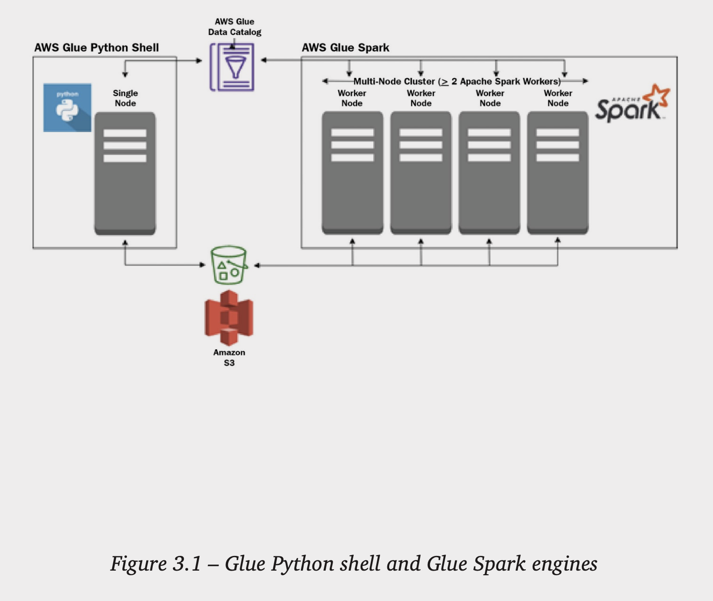
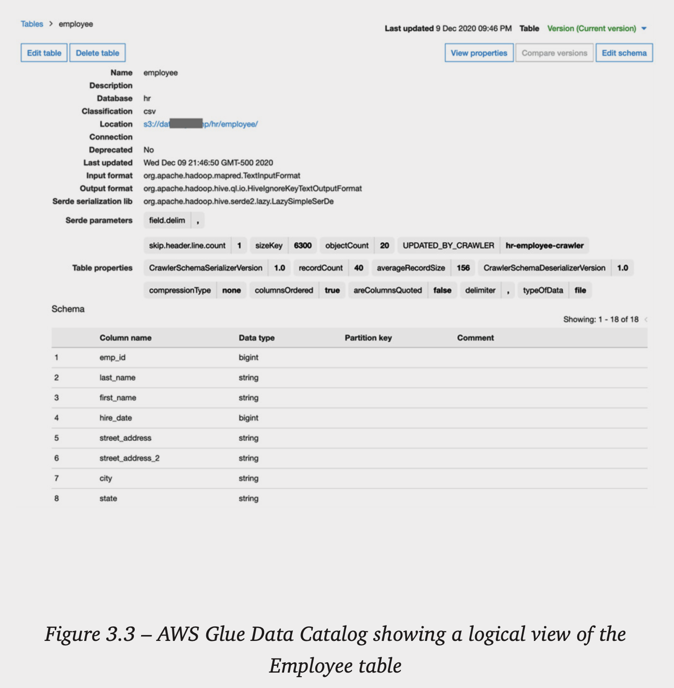
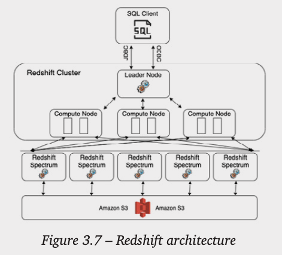

# AWS services for ingesting data
## Overview of Amazon Database Migration Service (DMS)

- AWS Database Migration Service (DMS) is a versatile tool that can be used to migrate an existing database system to a new database engine, such as migrating an existing Oracle database to an Amazon Aurora PostgreSQL database. 
- But from an analytics perspective, AWS DMS can also be used to run continuous replication from a number of common database engines into an Amazon S3 data lake.
- With transactional databases, the rows in a table are regularly updated, such as if a customer changes their address or telephone number. 
- When querying the database using SQL, we can see the updated information, but in most cases, there is no practical method to track changes to the database using only SQL. 
- Because of this, DMS uses the database transaction log files from the database to track updates to rows in the database and writes out the target file in S3 with an extra column added (Op) that indicates which operation is reflected in the row – an insert, update, or deletion. 
- The process of tracking and recording these changes is commonly referred to as **Change Data Capture (CDC).**
- We would then have a separate update process that would run to read the updates and apply those updates to the full load, creating a new point-in-time snapshot of our source database. 
- The update process would be scheduled to run regularly, and each time it runs it would apply the latest updates as recorded by DMS to the previous snapshot, creating a new point-in-time snapshot.
- **When to use**: Amazon DMS simplifies migrating from one database engine to a different database engine, or syncing data from an existing database to Amazon S3 on an ongoing basis.
- **When not to use**: If you're looking to sync an on-premises database to the same engine in AWS, it is often better to use native tools from that database engine. DMS is primarily designed for heterogeneous migrations (that is, from one database engine to a different database engine).

## Overview of Amazon Kinesis for streaming data ingestion

- **Amazon Kinesis** is a managed service that simplifies the process of ingesting and processing streaming data in real time, or near real time.
- There are a number of different use cases that Kinesis can be used for, including ingestion of streaming data (such as log files, website clickstreams, or IoT data), as well as video and audio streams.
- **Kinesis Data Firehose**: Ingests streaming data, buffers for a configurable period, then writes out to a limited set of targets (S3, Redshift, OpenSearch Service, Splunk, and others)
- **Kinesis Data Streams**: Ingests real-time data streams, processing the incoming data with a custom application and low latency
- **Kinesis Data Analytics**: Reads data from a streaming source and uses SQL statements or **Apache Flink** code to perform analytics on the stream
- **Kinesis Video Streams**: Processes streaming video or audio streams, as well as other time-serialized data such as thermal imagery and RADAR data.
- **Kinesis Agent** is used to package and send data to Kinesis services.

### Amazon Kinesis Agent
- AWS provides the **Kinesis Agent** to easily consume data from a system, and write that data out in a stream to either Kinesis Data Streams or Kinesis Data Firehose.
- The agent can be configured to monitor a set of files, and as new data is written to the file, the agent buffers the data (configurable for a duration of between 1 second and 15 minutes) and then writes the data to either Kinesis Data Streams, or Kinesis Data Firehose. 
- The agent handles retry on failure, as well as file rotation and checkpointing.
- An example of a typical use case is a scenario where you want to analyze events happening on your website in near real time. 
- The Kinesis Agent can be configured to monitor the Apache web server log files on your web server, convert each record from the Apache access log format to JSON format, and then write records out reflecting all website activity every 30 seconds to Kinesis, where Kinesis Data Analytics can be used to analyze events and generate custom metrics based on a tumbling 5-minute window.

### Amazon Kinesis Firehose
- Kinesis Firehose requires you to specify both a size and a time limit, and whichever is reached first will trigger the writing out of the file. 
- When writing files to Amazon S3, you also have the option of transforming the incoming data to Parquet or ORC format, or to perform custom transforms of the incoming data stream using an **Amazon Lambda function**. 
- Kinesis Data Firehose also supports **Dynamic Partitioning**, enabling you to specify a custom partitioning configuration.
- **When to use**: Amazon Kinesis Firehose is the ideal choice for when you want to receive streaming data, buffer that data for a period, and then write the data to one of the targets supported by Kinesis Firehose.
- **When not to use**: If your use case requires very low latency processing of incoming streaming data (that is, immediate reading of received records), or you want to use a custom application to process your incoming records or deliver records to a service not supported by Amazon Kinesis Firehose, then you should consider using Amazon Kinesis Data Streams or **Amazon Managed Streaming for Apache Kafka (MSK)** instead.

### Amazon Kinesis Data Streams
- While Kinesis Firehose buffers incoming data before writing it to one of its supported targets, Kinesis Data Streams provides increased flexibility for how data is consumed and makes the incoming data available to your streaming applications with very low latency (AWS indicates data is available to consuming applications within as little as 70 milliseconds of the data being written to Kinesis).
- Companies such as Netflix use Kinesis Data Streams to ingest terabytes of log data every day
- The **Amazon Kinesis Producer Library (KPL)** is a library that simplifies writing data records with high throughput to a Kinesis data stream.
- The Kinesis Agent is the simplest way to send data to Kinesis Data Streams if your data can be supported by the agent (such as when writing out log files), while the **AWS SDK** provides the lowest latency, and the Amazon KPL provides the best performance and simplifies tasks such as monitoring and integration with the **Kinesis Client Library (KCL).**
- There are also multiple options available for creating applications to read from your Kinesis data stream, including the following:
    - Using other Kinesis services (such as Kinesis Firehose or Kinesis Data Analytics).
    - Running custom code using the AWS Lambda service (a serverless environment for running code without provisioning or managing servers).
    - Setting up a cluster of Amazon EC2 servers to process your streams. With this approach you can use the KCL to handle many of the complex tasks associated with using multiple servers to process a stream, such as load balancing, responding to instance failures, checkpointing records that have been processed, and reacting to resharding (increasing or decreasing the number of shards used to process streaming data).
- Kinesis Data Streams supports two capacity modes. 
- With **Provisioned mode**, you need to specify the number of shards for the data stream upfront, and can then resize number of shards based on changing requirements. 
- With **On-Demand mode**, you do not need to do any capacity planning or sizing of the Kinesis cluster, as the cluster automatically scales to meet throughput requirements.

### Amazon Kinesis Data Analytics
- Amazon Kinesis Data Analytics simplifies the process of processing streaming data, using either standard SQL queries or an Apache Flink application.
- An example of a use case for Kinesis Data Analytics is to analyze incoming clickstream data from an e-commerce website to get near real-time insight into the sales of a product.

### Amazon Kinesis Video Streams
- Amazon Kinesis Video Streams can be used to process time-bound streams of unstructured data such as video, audio, and RADAR data.
- Kinesis Video Streams takes care of provisioning and scaling the compute infrastructure that is required to ingest streaming video (or other types of media files) from potentially millions of sources. 
- Kinesis Video Streams enables playback of video for live and on-demand viewing, and can be integrated with other Amazon API services to enable applications such as computer vision and video analytics.
- Appliances such as video doorbell systems, home security cameras, and baby monitors can stream video through Kinesis Video Analytics, simplifying the task of creating full-featured applications to support these appliances.

## Overview of Amazon MSK for streaming data ingestion
- Apache Kafka is a popular open source distributed event streaming platform that enables an organization to create high-performance streaming data pipelines and applications, and Amazon MSK (Managed Streaming for Apache Kafka) is a managed version of Apache Kafka available from AWS.
- While Apache Kafka is a popular choice for organizations, it can be a challenge to install, scale, update, and manage in an on-premises environment, often requiring specialized skills. 
- To simplify these tasks, AWS offers Amazon MSK, which enables an organization to deploy an Apache Kafka cluster with a few clicks in the console, and reduces the management overhead by automatically monitoring cluster health and replacing failed components, handling OS and application upgrades, deploying in multiple availability zones, and providing integration with other AWS services. 
- With Amazon MSK you need to specify compute and storage capacity for the cluster, however Amazon MSK is also offered as a serverless cluster type. 
- With this option, you do not need to specify and manage cluster capacity, as Amazon MSK Serverless automatically deploys and scales the required compute and storage.
- Generally MSK Serverless is best suited for unpredictable workloads where there are spikes and troughs in streaming throughput.
- **When not to use**: Amazon Kinesis may be a preferred streaming solution if you are creating a new solution from scratch, and you are looking for the best integration with other AWS services.

## Overview of Amazon AppFlow for ingesting data from SaaS services
- Amazon AppFlow can be used to ingest data from popular SaaS services, and to transform and write the data out to common analytic targets, such as Amazon S3, Amazon EventBridge, Amazon Redshift, and Snowflake, as well as being able to write to some SaaS services.
- AppFlow can be configured to run on a schedule, or in response to specific events (for certain sources), and can filter data, mask data, validate data, and perform calculations from data fields in the source.
- Total 50 connectors, few of them are: Datadog, Facebook, Google Analytics, GitHub, LinkedIn, Salesforce, SAP OData, ServiceNow, Slack, Snowflake, Stripe, QuickBooks, Zoom

## Overview of AWS Transfer Family for ingestion using FTP/SFTP protocols
- The AWS Transfer Family provides a fully managed service that enables file transfers directly into and out of Amazon S3 using common file transfer protocols, including FTP and SFTP.

## Overview of AWS DataSync for ingesting from on-premises storage
- There is often a requirement to ingest data from existing on-premises storage systems, and AWS DataSync simplifies this process while offering high performance and stability for the data transfers.
- **Network File System (NFS) and Server Message Block (SMB)** are two common protocols that are used to allow computer systems to access files stored on a different system. 
- With DataSync, you can easily ingest and replicate data from file servers that use either of these protocols. 
- DataSync also supports ingesting data from on-premises object-based storage systems that are compatible with core AWS S3 API calls, as well as from Hadoop Distributed File Systems (HDFS), which are commonly used for on-premise data lakes. 
- DataSync can write to multiple targets within AWS, including Amazon S3, making it an ideal way to sync data from on-premises storage, or on-premises data lakes, into your AWS S3 based data lake.
- **When not to use**: For very large historical datasets where sending the data over a network connection is not practical, you should consider using the **Amazon Snow** family of devices.

## Overview of the AWS Snow family of devices for large data transfers
- The AWS Snow family of devices are ruggedized devices that can be shipped to a location and attached to a network connection in the local data center. 
- Data can be transferred over the local network, and the device is then shipped back to AWS where the data will be transferred to Amazon S3. 
- All the devices offer encryption of data at rest, and most of the devices also offer compute ability, enabling edge computing use cases.
- There are multiple devices available for different use cases, as summarized here:

    - AWS Snowcone: Lightweight (4.5 lb/2.1 kg) device with 8 - 14 TB of usable storage
    - AWS Snowball Edge Optimized for Data Transfer: Mediumweight (49.7 lb/22.5 kg) device with up to 80 TB of usable HDD storage
    - AWS Snowmobile: Large 45-foot ruggedized shipping container pulled by a semi-trailer truck. Capacity of up to 100 PB

## Overview of AWS Glue for data ingestion
- AWS Glue provides a serverless Apache Spark environment where you can create code-based solutions for both data ingestion and transformation. 
- AWS Glue includes a number of built-in connectors for connecting to certain AWS and 3rd party services, including Amazon RDS, Amazon Redshift, Amazon DocumentDB, MongoDB, MongoDB Atlas, and various JDBC accessible sources.

# AWS services for transforming data
## Overview of AWS Lambda for light transformations
- AWS Lambda provides a serverless environment for executing code, and is one of AWS's most popular services. 
- You can trigger your Lambda function to execute your code in multiple ways, including through integration with other AWS services, and you only pay for the duration that your code executes, billed in 1-millisecond increments, and based on the amount of memory that you allocate for your function. 
- Lambda can scale from a few executions per day, to thousands of executions per second. 
- In the data engineering world, a common use case for Lambda is for performing validation or light processing and transformation of incoming data.
- With the ability to run for up to 15 minutes, and with a maximum memory configuration of 10 GB, it is possible to do more advanced processing as well.
- Lambda is also massively parallel, meaning that it can easily scale for highly concurrent workloads.
- By default, you can have 1,000 concurrent Lambda executions within an AWS Region for your account, but you can work with AWS support to increase this limit into the tens of thousands.
- AWS Lambda supports many different languages, including Python.

## Overview of AWS Glue for serverless data processing
- AWS Glue has multiple components that could have been split into multiple separate services, but these components can all work together, and so AWS has grouped them together into the **AWS Glue family**.

### Serverless ETL processing
- Python, which traditionally runs on a single node, has become an extremely popular language for performing data science/data engineering-related tasks on small – medium sized datasets.
- **Ray.io** is an open-source framework that enables running Python code over multiple compute nodes

- Both engines can work with data that resides in Amazon S3, and with the **AWS Glue Data Catalog**.
- A user just needs to specify the number of **Data Processing Units (DPUs)** that they want to power their job. 
- Glue ETL jobs are charged based on the number of DPUs configured, as well as the amount of time that the underlying code executes for in the environment.
- AWS Glue does provide additional Spark libraries and functionality to simplify some common ETL tasks, also supports Spark Streaming.
- You can generate Spark code through a GUI based tool with **Glue Studio**

### AWS Glue DataBrew
- AWS Glue DataBrew is another serverless visual data preparation tool that lets you easily apply transformations to your data, without needing to write or manage any code. 
- DataBrew includes over 250 built-in data transformations, which can be easily assembled via the DataBrew UI to create a **DataBrew recipe**, enabling you to apply multiple transformations to a dataset. 
- DataBrew is commonly used by data analysts and data scientists to clean and prepare data for additional processing.

### AWS Glue Data Catalog
- AWS Glue also includes a data catalog that can be used to provide a logical view of data stored physically in the storage layer. 
- Objects (such as databases and tables) in the catalog can then be directly referenced from your ETL code. 
- The Glue Data Catalog is a Hive metastore compatible catalog, meaning that it can be used with any system that is able to work with a Hive metastore.
- The Hive metastore, and therefore the Glue Data Catalog, is a technical catalog.
- For example, the data catalog consists of a number of databases at the top level (such as the HR database), and each database contains one or more tables (such as the Employee table), and each table contains metadata, such as the column headings and data types for each column (such as employee_id, lastname, firstname, address, and dept), a reference to the S3 location for the data that makes up that table, and details on the file format (such as CSV).

- A number of services can use the AWS Glue Data Catalog. 
- For example, Amazon Athena uses the AWS Glue Data Catalog to enable users to run SQL queries directly on data in Amazon S3.

### AWS Glue Crawlers
- AWS Glue crawlers are processes that can examine a data source (such as a path in an S3 bucket) and automatically infer the schema and other information about that data source, so that the AWS Glue Data Catalog can be automatically populated with relevant information.
- You can also add databases and tables to the Glue Data Catalog using the **Glue API**, or via SQL statements in **Athena**, so using Glue crawlers to automatically populate the catalog is optional.

## Overview of Amazon EMR for Hadoop ecosystem processing
- Amazon EMR provides a managed platform for running popular open source big data processing tools, such as Apache Spark, Apache Hive, Apache Hudi, Apache HBase, Presto, Pig, and others. 
- Amazon EMR takes care of the complexities of deploying these tools and managing the underlying clustered compute resources.
- Like many other AWS services, Amazon EMR can run in a provisioned mode (where you specify specific compute resources to use), or it can be run in a serverless mode.
- Alternatively you can select to run Spark workloads using Amazon EMR on an **EKS (Elastic Kubernetes Service)** cluster.
- EMR Serverless provides you with an option to run certain workloads without needing to decide on and select EC2 instance types.
- With **EMR Serverless**, you can create an application that runs either Spark or Hive as the processing engine, and then select a maximum for CPU, memory and storage for that application. 
- You can optionally select to pre-initialize Spark drivers and workers for your application, which then creates a warm pool of workers for an application. 
- While there is a cost to have the warm pool running, it does enable submitted jobs to start processing immediately, and you can optionally specify a timeout, after which the application will stop if idle. 
- If you do not pre-initialize capacity, it may take a few minutes for a submitted job to run, but it is the most cost-effective way to run your jobs as you do not pay for application idle time. 
- Once an application is running, you can submit multiple Spark jobs to the application.
- AWS Glue requires the least amount of configuration as you just need to specify a worker type, and a maximum number of DPU’s for each job, and can then submit a Spark job to run. 
- Using EMR Serverless requires a bit more configuration as you need to configure an application, and can then submit jobs to that application. 
- However, you have more control over both number of CPU’s and memory for each worker, and the cost for equivalent processing power is slightly lower than Glue. 
- Amazon EMR provisioned clusters (on EC2 or EKS) requires more expertise to manage, but provides the most control for fine-tuning your Spark jobs.
- It also supports a wide range of big data processing applications beyond Spark(such as Hive, Presto, and Trino) and is the lowest cost method for running Spark jobs in AWS. 
- One of the other differences is that AWS Glue has a number of built-in connectors, as well as a marketplace with additional connectors, that can make it easier to integrate your Spark code with external systems.
- Each EMR provisioned cluster requires a master node, and at least one core node (a worker node that includes local storage), and then optionally a number of task nodes (worker nodes that do not have any local storage).

# AWS services for orchestrating big data pipelines
## Overview of AWS Glue workflows for orchestrating Glue components
- AWS Glue workflows are a functionality within the AWS Glue service and have been designed to help orchestrate the various AWS Glue components. 
- A workflow consists of an ordered sequence of steps that can run Glue crawlers and Glue ETL jobs (Spark or Python shell).
- Each step of the workflow can retrieve and update the state information about the workflow. 
- This enables one step of a workflow to provide state information that can be used by a subsequent step in the workflow. 
- For example, a workflow may run multiple ETL jobs, and each ETL job can update state information, such as the location of files that it outputted, that will be available to be used by subsequent workflow steps.
- Glue workflows can only be used to orchestrate Glue components, which are ETL jobs and Glue crawlers.

## Overview of AWS Step Functions for complex workflows
- AWS Step Functions is a service that enables you to create complex workflows that can be integrated with over 220 AWS services, without needing to maintain code. 
- Step Functions is serverless, meaning that you do not need to deploy or manage any infrastructure, and you pay for the service based on your usage, not on fixed infrastructure costs.
- With Step Functions, you use JSON to define a state machine using a structured language known as the **Amazon States Language**. 
- Alternatively, you can use **Step Functions Workflow Studio** to create a workflow using a visual interface that supports drag and drop.
- When you start a state machine, you include JSON data as input text that will be passed to the first state in the workflow. 
- The first state in the workflow uses the input data, performs the function it is configured to do (such as running a Lambda function using the input passed into the state machine), modifies the JSON data, and then passes the modified JSON data to the next state in the workflow.
- You can trigger a step function using **Amazon EventBridge** (such as on a schedule or in response to something else triggering an EventBridge event), as well as various other AWS services (such as **Amazon API Gateway, AWS CodePipeline, or AWS IoT Rules Engine**). 
- You can also trigger a step function on-demand, by calling the **Step Functions API**.

## Overview of Amazon Managed Workflows for Apache Airflow (MWAA)
- **Apache Airflow** is a popular open source solution for orchestrating complex data engineering workflows. 
- It was created by Airbnb in 2014 to help their internal teams manage their increasingly complex workflows, and became a top-level Apache project in 2019.
- Airflow enables users to create processing pipelines programmatically (using the Python programming language) and provides a user interface to monitor the execution of the workflows. 
- Complex workflows can be created, and Airflow includes support for a wide variety of integrations, including integrations with services from AWS, Microsoft Azure, Google Cloud Platform, and others.
- MWAA enables users to easily deploy a managed version of Apache Airflow that can automatically scale out additional workers as demand on the environment increases, and scale in the number of workers as demand dereases.
- An MWAA environment consists of the following components:
    - Scheduler: The scheduler runs a multithreaded Python process that controls what tasks need to be run, and where and when to run those tasks.
    - Worker/executor: The worker/s execute/s tasks. Each MWAA environment contains at least one worker, but when configuring the environment, you can specify the maximum number of additional workers that should be made available.
    - Meta-database: This runs in the MWAA service account and is used to track the status of tasks.
    - Web server: The web server also runs in the MWAA service account and provides a web-based interface that users can use to monitor and execute tasks.

- There are separate instances of these for every MWAA environment, and there are no components of the architecture that are shared between different MWAA environments.
- It is not a serverless environment.
- With MWAA, you select a core environment size (small, medium, or large), and are charged based on the environment size, plus a charge for the amount of storage used by the meta-database and for any additional workers you make use of.

# AWS services for consuming data

## Overview of Amazon Athena for SQL queries in the data lake
- Amazon Athena is a serverless solution for using standard SQL queries to query data that exists in a data lake, or in other data sources. 
- As soon as a dataset has been written to Amazon S3 and cataloged in the AWS Glue Data Catalog, users can run complex SQL queries against the data without needing to set up or manage any infrastructure.
- Many tools are designed to interface with data via SQL, and these tools often connect to the SQL data source using either a JDBC or ODBC database connection. 
- Amazon Athena enables a data consumer to query datasets in the data lake (or other connected data sources) through the AWS Management Console interface, or through a JDBC or ODBC driver.
- Graphical SQL query tools, such as **SQL Workbench**, can connect to Amazon Athena via the JDBC driver, and you can programmatically connect to Amazon Athena and run SQL queries in your code through the ODBC driver.
- **Athena Federated Query**, a feature of Athena, enables you to build connectors so that Athena can query other data sources, beyond just the data in an S3 data lake. 
- Amazon provides a number of pre-built open source connectors for Athena, enabling you to connect Athena to sources such as **Amazon DynamoDB (a NoSQL database)**, as well as other Amazon-managed relational database engines, and even **Amazon CloudWatch Logs**, a centralized logging service.
- **Amazon Athena for Apache Spark** is a new functionality that enables running Apache Spark jobs with Athena. 
- With this new feature you can launch a Jupyter Notebook from within the Athena console, and query data in the data lake using Apache Spark code.

## Overview of Amazon Redshift and Redshift Spectrum for data warehousing and data lakehouse architectures

- Amazon Redshift was the first cloud-based data warehouse to be created. 
- Launched in 2012, it was AWS's fastest-growing service by 2015, and today there are tens of thousands of customers that use it.
- A Redshift data warehouse is designed for reporting and analytic workloads, commonly referred to as **Online Analytical Processing (OLAP)** workloads.
- Redshift provides a clustered environment that enables all the compute nodes in the cluster to work with portions of the data involved in a SQL query, helping to provide the best performance for scenarios where you are working with data that has been stored in a highly structured manner, and you need to do complex joins across multiple large tables on a regular basis. 
- As a result, Redshift is an ideal query engine for reporting and visualization services that need to work with large datasets.
- The queries run against the data warehouse will often be used to answer questions such as "What was the average sale amount for sales in our stores last month, broken down by each ZIP code of the USA?", or "Which products, across all of our stores, have seen a 20% increase in sales between Q4 last year and Q1 of this year?"
- **Redshift Spectrum** is a feature of Amazon Redshift that enables a user to write a single query that queries data that has been loaded into the data warehouse, as well as data that exists outside the data warehouse, in the data lake.
- To enable this, the data engineer can configure the Redshift cluster to connect with the AWS Glue Data Catalog, where all the databases and tables for our data lake are defined.

- We can see that a user connects to the Redshift leader node (via JDBC or ODBC). 
- This node does not query data directly but is effectively the central brain behind all the queries that do run on the cluster.

1. Using a SQL client, the user makes a connection and authenticates with the Redshift leader node, and sends through a SQL statement that queries both the current_sales table (a table in which the data exists within the Redshift cluster and contains the past 12 months of sales data) and the historical_sales table (a table that is registered in the Glue Data Catalog, and where the data files are located in the Amazon S3 data lake, which contains historical sales data going back 10 years).

2. The leader node analyzes and optimizes the query, compiles a query plan, and pushes individual query execution plans to the compute nodes in the cluster.

3. The compute nodes query data they have locally (for the current_sales table) and query the AWS Glue Data Catalog to gather information on the external historical_sales table. 

    Using the information they gathered, they can optimize queries for the external data and push those queries out to the Redshift Spectrum layer.

4. Redshift Spectrum is outside of a customer's Redshift cluster and is made up of thousands of worker nodes (Amazon EC2 compute instances) in each AWS Region. 
    These worker nodes are able to scan, filter, and aggregate data from the files in Amazon S3, and then stream results back to the Amazon Redshift cluster.

5. The Redshift cluster performs final operations to join and merge data, and then returns the results to the user's SQL client.

6. Redshift also includes a number of advanced features, such as data sharing between Redshift clusters, automatic optimization of tables, integration with Machine Learning through Redshift ML, and the ability to mask data through data masking policies.

## Overview of Amazon QuickSight for visualizing data
- **Amazon QuickSight** is a service from AWS that enables the creation of these types of complex visualizations, but beyond just providing static visuals, the charts created by QuickSight enable users to filter data and drill down to get further details.
- Amazon QuickSight is serverless, which means there are no servers for the organization to set up or manage, and there is a simple monthly fee based on the user type (either an author, who can create new visuals, or a reader, who can view visuals created by authors).
- A data engineer can configure QuickSight to access data from a multitude of sources, including accessing data in an Amazon S3-based data lake via integration with Amazon Athena.

# Hands-on
- Lambda layers allow your Lambda function to bring in additional code, packaged as a .zip file.
- Create a layer, then a policy. Attach the policy to the a new role. Create a lambda function from an existing role. Attach layer to it. Add code to the function and timeout. Add trigger to lambda function. 